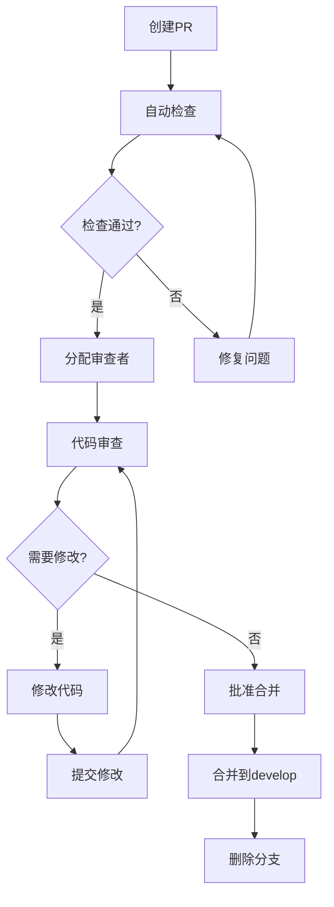

# 开发者贡献指南

> **学习目标**：完成本指南学习后，你将能够为火宝短剧项目贡献高质量的代码，了解项目的开发流程、代码规范和审查标准，具备独立完成功能开发的能力。
> 
> **前置知识**：建议具备Go语言开发经验，熟悉Git版本控制，了解RESTful API设计模式。建议先完成《架构设计文档》的学习，理解系统的整体架构。
> 
> **难度等级**：⭐⭐⭐（进阶）
> 
> **预计学习时间**：4-8小时

---

## 第一章：贡献概述

### 1.1 欢迎贡献

火宝短剧是一个开源的AI短剧生成平台项目的开源社区版，我们欢迎所有开发者参与贡献。无论是修复小bug、改进文档、添加新功能，还是提出建议和反馈，每一位贡献者都是项目发展的重要力量。

在开始贡献之前，请花一些时间阅读本指南。它将帮助你了解项目的开发流程、代码规范和协作方式，使你的贡献过程更加顺利。遵循这些指南不仅能提高你的贡献被接受的几率，也能帮助维护者更高效地审核你的贡献。

**为什么贡献开源项目**：参与开源贡献是提升技术能力的有效途径。通过阅读和理解优秀的代码库，你可以学习到行业最佳实践；通过解决实际问题，你可以积累实战经验；通过与社区互动，你可以建立技术人脉。我们相信，每一位贡献者都会在这个过程中有所收获。

### 1.2 贡献方式

火宝短剧项目接受多种形式的贡献：

| 贡献类型 | 说明 | 适合人群 |
|----------|------|----------|
| 代码贡献 | 修复bug、添加功能、优化性能 | 有开发经验的程序员 |
| 文档改进 | 完善文档、修正错误、补充示例 | 所有开发者 |
| 问题报告 | 发现并报告bug、提供复现步骤 | 所有用户 |
| 功能建议 | 提出新功能想法、改进建议 | 所有用户 |
| 社区支持 | 回答问题、帮助其他用户 | 有经验的用户 |

**首次贡献建议**：如果是首次参与开源贡献，建议从简单的任务开始。例如，修复文档中的拼写错误、改进代码注释、或者回答社区问题。这些任务可以帮助你熟悉贡献流程，为后续更大的贡献打下基础。

### 1.3 行为准则

我们致力于打造一个友好、包容的社区。所有贡献者应遵守以下行为准则：

**基本准则**：

1. **尊重他人**：与社区成员交流时保持礼貌和尊重，即使观点不同也要理性讨论
2. **开放心态**：欢迎不同背景和经验的贡献者，耐心解答初学者的问题
3. **建设性反馈**：提供反馈时具体、友善、有建设性，避免人身攻击或负面评价
4. **承担责任**：对自己提交的代码负责，确保质量并愿意改进

**不可接受的行为**：

- 人身攻击或歧视性言论
- 公开他人隐私信息
- 垃圾信息或无关内容
- 其他不当行为

违反行为准则的行为将被严肃处理，可能包括警告、暂停贡献权限或永久禁止参与项目。

---

## 第二章：开发环境搭建

### 2.1 环境要求

在开始开发之前，需要搭建完整的开发环境。以下是推荐的环境配置。

**基础开发工具**：

| 工具 | 最低版本 | 推荐版本 | 说明 |
|------|----------|----------|------|
| Go | 1.21 | 1.23+ | 后端开发运行时 |
| Git | 2.0 | 2.40+ | 版本控制 |
| Docker | 20.10 | 24.0+ | 容器化开发 |
| Visual Studio Code | 1.80 | 最新版 | 代码编辑器 |
| GoLand | 2023.2 | 最新版 | Go专业IDE（可选） |

**编辑器配置建议**（Visual Studio Code）：

```json
{
  "editor.formatOnSave": true,
  "go.useLanguageServer": true,
  "[go]": {
    "editor.defaultFormatter": "golang.go",
    "editor.codeActionsOnSave": {
      "source.organizeImports": true
    }
  },
  "files.eol": "\n",
  "files.autoSave": "afterDelay"
}
```

### 2.2 本地开发环境搭建

**步骤一：克隆项目代码**：

```bash
# 使用SSH方式（推荐，已配置SSH Key）
git clone git@github.com:chatfire-AI/huobao-drama.git

# 或使用HTTPS方式
git clone https://github.com/chatfire-AI/huobao-drama.git

# 进入项目目录
cd huobao-drama
```

**步骤二：安装Go依赖**：

```bash
# 下载所有Go模块依赖
go mod download

# 验证依赖安装
go list -m all | head -20

# 安装代码检查工具
go install golang.org/x/tools/cmd/goimports@latest
go install github.com/golangci/golangci-lint/cmd/golangci-lint@latest
```

**步骤三：启动开发服务**：

```bash
# 方式一：直接运行
go run main.go

# 方式二：使用Air实现热重载（推荐）
# 安装Air
go install github.com/air-verse/air@latest

# 创建Air配置文件
cat > .air.toml << 'EOF'
[root]
target = "main.go"

[build]
cmd = "go build -o ./tmp/main ."
bin = "./tmp/main"
include_ext = ["go", "tpl", "tmpl", "html"]
exclude_dir = ["tmp", "vendor", "web/node_modules"]
delay = 1000
poll = false

[log]
time_format = "2006/01/02 - 15:04:05"
main_only = true

[screen]
clear_on_rebuild = true
EOF

# 启动开发服务器
air
```

**步骤四：前端开发环境**：

```bash
# 进入前端目录
cd web

# 安装依赖
npm install --registry=https://registry.npmmirror.com/

# 启动开发服务器
npm run dev

# 前端开发服务器运行在 http://localhost:3012
# API请求会自动代理到 http://localhost:5678
```

### 2.3 Docker开发环境

对于不熟悉本地环境配置的开发者，也可以使用Docker搭建开发环境：

```bash
# 启动开发环境（包含热重载支持）
docker compose -f docker-compose.dev.yml up -d

# 查看日志
docker compose -f docker-compose.dev.yml logs -f app

# 进入容器进行开发
docker exec -it huobao-drama-dev bash
```

---

## 第三章：代码规范与标准

### 3.1 Go代码规范

火宝短剧项目遵循Go社区的通用代码规范，并在此基础上增加了项目特定的要求。

**命名规范**：

| 元素 | 规则 | 示例 |
|------|------|------|
| 包名 | 简短、全小写、使用单数 | `domain`、`repository` |
| 变量名 | 驼峰命名、避免缩写 | `projectID` 而非 `pid` |
| 常量名 | 全大写、下划线分隔 | `ErrProjectNotFound` |
| 接口名 | 以er结尾 | `IRepository`、`IService` |
| 结构体 | 驼峰命名 | `ProjectService` |

**函数和方法的顺序**：

```go
type ProjectService struct {
    // 依赖项放在前面
    projectRepo domain.IProjectRepository
    logger      *zap.Logger
}

// NewXxx 构造函数放在最前面
func NewProjectService(repo domain.IProjectRepository, logger *zap.Logger) *ProjectService {
    return &ProjectService{
        projectRepo: repo,
        logger:      logger,
    }
}

// 方法按功能分组，按调用顺序排列
// CRUD方法
func (s *ProjectService) Create(ctx context.Context, req *CreateRequest) (*Project, error) {
    // ...
}

func (s *ProjectService) GetByID(ctx context.Context, id string) (*Project, error) {
    // ...
}

func (s *ProjectService) Update(ctx context.Context, id string, req *UpdateRequest) error {
    // ...
}

func (s *ProjectService) Delete(ctx context.Context, id string) error {
    // ...
}

// 业务方法放在后面
func (s *ProjectService) GenerateScript(ctx context.Context, req *GenerateScriptRequest) (*Task, error) {
    // ...
}
```

**错误处理规范**：

```go
// 推荐：直接返回错误
func (s *ProjectService) Create(ctx context.Context, req *CreateRequest) (*Project, error) {
    // 检查参数
    if req.Name == "" {
        return nil, domain.ErrInvalidArgument
    }
    
    // 创建项目
    project, err := domain.NewProject(req.Name, req.Description, req.OwnerID)
    if err != nil {
        return nil, err
    }
    
    // 保存
    if err := s.projectRepo.Save(ctx, project); err != nil {
        return nil, err
    }
    
    return project, nil
}

// 不推荐：嵌套过深
func (s *ProjectService) Create(ctx context.Context, req *CreateRequest) (*Project, error) {
    if req.Name != "" {
        if project, err := domain.NewProject(req.Name, req.Description, req.OwnerID); err == nil {
            if err := s.projectRepo.Save(ctx, project); err == nil {
                return project, nil
            }
        }
    }
    return nil, errors.New("failed")
}
```

**注释规范**：

```go
// ProjectService 处理项目相关的业务逻辑
//
// 提供项目的创建、查询、更新、删除等操作，
// 以及与AI服务集成生成剧本等功能。
type ProjectService struct {
    // projectRepo 提供项目数据的持久化操作
    projectRepo domain.IProjectRepository
    // logger 用于记录服务运行日志
    logger *zap.Logger
}

// Create 创建新项目
//
// 该方法会验证项目名称的唯一性，
// 并将创建的项目保存到数据库中。
//
// 参数：
//   ctx - 上下文对象，用于控制请求超时和取消
//   req - 创建项目的请求参数
//
// 返回：
//   创建成功的项目对象
//   创建过程中的错误信息
func (s *ProjectService) Create(ctx context.Context, req *CreateRequest) (*Project, error) {
    // 实现代码
}
```

### 3.2 Git提交规范

**提交信息格式**：

```
<类型>(<范围>): <描述>

[可选的正文]

[可选的脚注]
```

**类型标识**：

| 类型 | 说明 | 示例 |
|------|------|------|
| feat | 新功能 | `feat(script): 添加剧本模板功能` |
| fix | 修复bug | `fix(api): 修复项目创建接口的验证bug` |
| docs | 文档改进 | `docs: 更新API接口文档` |
| style | 代码格式（不影响功能） | `style: 运行goimports格式化` |
| refactor | 重构 | `refactor: 重构聚合根创建逻辑` |
| perf | 性能优化 | `perf: 优化数据库查询性能` |
| test | 添加测试 | `test: 增加项目服务单元测试` |
| chore | 构建工具或辅助工具 | `chore: 更新CI配置文件` |

**提交信息示例**：

```
feat(script): 支持从模板创建剧本

- 添加剧本模板定义和存储
- 实现从模板生成剧本的功能
- 添加相关的单元测试

Closes #123
```

**提交频率建议**：

1. **小提交原则**：每次提交只做一件事，便于代码审查和问题追溯
2. **完成性原则**：提交应该是完整的、可独立使用的功能片段
3. **及时提交原则**：不要积累大量更改后再提交，建议每天至少提交一次

### 3.3 代码审查标准

**提交PR前的自检清单**：

| 检查项 | 说明 | 状态 |
|--------|------|------|
| 代码编译通过 | `go build ./...` 无错误 | ☐ |
| 测试通过 | `go test ./...` 全部通过 | ☐ |
| 代码格式化 | `gofmt -w .` 无变化 | ☐ |
| 静态检查通过 | `golangci-lint run` 无警告 | ☐ |
| 注释完整 | 公开API都有文档注释 | ☐ |
| 变更日志更新 | CHANGELOG.md已更新 | ☐ |
| PR描述完整 | 包含目的、变更、测试说明 | ☐ |

**PR描述模板**：

```markdown
## 变更说明

[请描述本次变更的目的和主要内容]

## 变更类型

- [ ] 新功能（feature）
- [ ] bug修复（fix）
- [ ] 文档更新（docs）
- [ ] 代码重构（refactor）
- [ ] 性能优化（perf）
- [ ] 测试相关（test）

## 测试说明

[请描述如何测试本次变更]

### 测试步骤

1. [步骤一]
2. [步骤二]
3. [步骤三]

### 预期结果

[请描述测试通过后的预期结果]

## 相关Issue

[请关联相关的Issue编号]

## 截图或演示

[如果是UI变更，请添加截图或GIF演示]
```

---

## 第四章：开发流程

### 4.1 Git分支策略

项目采用Git Flow的简化分支策略，主要使用以下分支：

| 分支名 | 用途 | 保护级别 |
|--------|------|----------|
| main | 主分支，始终保持可发布状态 | 强制保护 |
| develop | 开发分支，集成最新开发成果 | 强制保护 |
| feature/* | 功能开发分支 | 可自由创建 |
| hotfix/* | 紧急修复分支 | 需要审批 |

**分支命名规范**：

```
# 功能分支
feature/{issue-id}-{short-description}
示例：feature/123-add-script-template

# 修复分支
fix/{issue-id}-{short-description}
示例：fix/456-fix-api-validation

# 热修复分支
hotfix/{version}-{short-description}
示例：hotfix/v1.0.1-critical-bug
```

**开发流程**：

```bash
# 1. 从develop分支创建功能分支
git checkout develop
git pull origin develop
git checkout -b feature/123-add-new-feature

# 2. 开发并提交代码
# ... 编写代码 ...
git add .
git commit -m "feat: 添加新功能描述"

# 3. 保持分支同步（定期）
git checkout develop
git pull origin develop
git checkout feature/123-add-new-feature
git merge develop

# 4. 完成开发后，推送并创建PR
git push -u origin feature/123-add-new-feature
```

### 4.2 Issue和PR流程

**创建Issue**：

发现问题时，请创建Issue帮助我们跟踪和修复：

```markdown
## 问题描述

[清晰描述问题的现象]

## 复现步骤

1. [步骤一]
2. [步骤二]
3. [步骤三]

## 预期行为

[描述你期望的正确行为]

## 实际行为

[描述实际发生的错误行为]

## 环境信息

- 操作系统：
- Go版本：
- Docker版本（如果使用）：
- 浏览器（如果是前端问题）：

## 错误日志

[如果有错误日志，请粘贴在此]
```

**创建Pull Request**：

```bash
# 1. 确保所有检查通过
go test ./...
golangci-lint run

# 2. 更新变更日志
git log --oneline --since="2024-01-01" --until="2024-12-31" > CHANGELOG.md

# 3. 推送分支
git push origin feature/123-add-new-feature

# 4. 在GitHub上创建PR
```

**PR审查流程**：



### 4.3 测试要求

**测试覆盖率要求**：

| 代码类型 | 最低覆盖率 |
|----------|-----------|
| 核心业务逻辑 | 80% |
| API接口 | 90% |
| 工具函数 | 100% |

**单元测试示例**：

```go
// project_service_test.go

func TestProjectService_Create(t *testing.T) {
    // Arrange - 准备测试数据
    mockRepo := mocks.NewMockProjectRepository(gomock.NewController(t))
    logger, _ := zap.NewDevelopment()
    service := NewProjectService(mockRepo, logger)
    
    req := &CreateRequest{
        Name:        "测试项目",
        Description: "测试描述",
    }
    
    // Expect - 设置预期行为
    mockRepo.EXPECT().Save(gomock.Any(), gomock.Any()).Return(nil)
    
    // Act - 执行测试
    project, err := service.Create(context.Background(), req)
    
    // Assert - 验证结果
    assert.NoError(t, err)
    assert.Equal(t, "测试项目", project.Name)
    assert.Equal(t, "测试描述", project.Description)
}
```

**API测试示例**：

```go
// api_test.go

func TestCreateProject(t *testing.T) {
    // 启动测试服务器
    ts := httptest.NewServer(http.HandlerFunc(func(w http.ResponseWriter, r *http.Request) {
        // 处理请求...
    }))
    defer ts.Close()
    
    // 发送请求
    resp, err := http.Post(
        ts.URL+"/api/v1/projects",
        "application/json",
        strings.NewReader(`{"name":"测试项目"}`),
    )
    
    // 验证响应
    assert.NoError(t, err)
    assert.Equal(t, http.StatusCreated, resp.StatusCode)
}
```

---

## 第五章：项目架构指南

### 5.1 代码结构说明

理解项目的代码结构是有效贡献的基础。以下是主要目录的职责说明：

```
huobao-drama/
├── api/                    # API层 - HTTP请求处理
│   ├── handlers/          # HTTP处理器
│   ├── middleware/        # 中间件（认证、日志、限流）
│   ├── request/          # 请求参数定义
│   └── response/         # 响应格式化
├── application/           # 应用服务层 - 业务流程编排
│   ├── services/         # 应用服务实现
│   ├── tasks/            # 任务调度
│   └── events/           # 事件处理器
├── domain/               # 领域层 - 核心业务逻辑
│   ├── aggregates/       # 聚合根
│   ├── entities/         # 实体
│   ├── valueobjects/     # 值对象
│   ├── services/         # 领域服务
│   ├── events/           # 领域事件
│   └── repositories/     # 仓储接口
├── infrastructure/       # 基础设施层 - 技术实现
│   ├── persistence/     # 数据库访问
│   ├── external/        # 外部服务适配器
│   └── storage/         # 文件存储
├── pkg/                  # 公共包 - 可复用工具
│   ├── config/          # 配置管理
│   ├── logger/          # 日志封装
│   └── utils/           # 工具函数
└── web/                  # 前端应用
```

### 5.2 添加新功能的流程

以添加「剧本模板」功能为例，说明完整的开发流程：

**步骤一：领域层实现**：

```go
// domain/aggregates/script_template.go

// ScriptTemplate 剧本模板聚合根
type ScriptTemplate struct {
    ID          string    `json:"id" gorm:"primaryKey"`
    Name        string    `json:"name" gorm:"type:varchar(100)"`
    Description string    `json:"description" gorm:"type:text"`
    Content     string    `json:"content" gorm:"type:text"`
    Category    string    `json:"category" gorm:"type:varchar(50)"`
    
    CreatedAt   time.Time `json:"created_at"`
    UpdatedAt   time.Time `json:"updated_at"`
}

// ScriptTemplateRepository 仓储接口
type IScriptTemplateRepository interface {
    Create(ctx context.Context, template *ScriptTemplate) error
    GetByID(ctx context.Context, id string) (*ScriptTemplate, error)
    List(ctx context.Context, category string) ([]*ScriptTemplate, error)
    Delete(ctx context.Context, id string) error
}
```

**步骤二：应用服务层实现**：

```go
// application/services/script_template_service.go

type ScriptTemplateAppService struct {
    templateRepo domain.IScriptTemplateRepository
    logger       *zap.Logger
}

func (s *ScriptTemplateAppService) CreateFromTemplate(ctx context.Context, req *CreateFromTemplateRequest) (*domain.Script, error) {
    // 1. 获取模板
    template, err := s.templateRepo.GetByID(ctx, req.TemplateID)
    if err != nil {
        return nil, err
    }
    
    // 2. 从模板生成剧本
    script, err := s.generateScriptFromTemplate(ctx, template, req.Parameters)
    if err != nil {
        return nil, err
    }
    
    return script, nil
}
```

**步骤三：API层实现**：

```go
// api/handlers/script_template_handler.go

type ScriptTemplateHandler struct {
    service *application.ScriptTemplateAppService
}

func (h *ScriptTemplateHandler) RegisterRoutes(r *gin.Engine) {
    templates := r.Group("/api/v1/script-templates")
    {
        templates.GET("", h.List)
        templates.GET("/:id", h.GetByID)
        templates.POST("/generate", h.GenerateFromTemplate)
    }
}

// List 获取模板列表
func (h *ScriptTemplateHandler) List(c *gin.Context) {
    // 实现...
}
```

**步骤四：添加测试**：

```go
// application/services/script_template_service_test.go

func TestScriptTemplateAppService_CreateFromTemplate(t *testing.T) {
    // 编写测试代码
}
```

**步骤五：更新文档**：

```markdown
## 新增功能：剧本模板

### 功能说明

剧本模板功能允许用户从预设模板快速创建剧本...

### API接口

- `GET /api/v1/script-templates` - 获取模板列表
- `POST /api/v1/script-templates/generate` - 从模板生成剧本
```

---

## 第六章：持续集成与部署

### 6.1 CI/CD流程

项目使用GitHub Actions实现持续集成和持续部署：

```yaml
# .github/workflows/ci.yml

name: CI

on:
  push:
    branches: [main, develop]
  pull_request:
    branches: [main, develop]

jobs:
  build:
    runs-on: ubuntu-latest
    
    steps:
      - uses: actions/checkout@v4
      
      - name: Set up Go
        uses: actions/setup-go@v5
        with:
          go-version: '1.23'
          
      - name: Cache Go modules
        uses: actions/cache@v3
        with:
          path: |
            ~/.cache/go-build
            ~/go/pkg/mod
          key: ${{ runner.os }}-go-${{ hashFiles('**/go.sum') }}
          
      - name: Build
        run: go build -v ./...
        
      - name: Test
        run: go test -v -race -coverprofile=coverage.txt ./...
        
      - name: Lint
        run: golangci-lint run
        
      - name: Upload coverage
        uses: codecov/codecov-action@v3
        with:
          files: ./coverage.txt
```

### 6.2 发布流程

**版本号规范**：项目遵循语义化版本（Semantic Versioning）规范：

```
主版本号.次版本号.修订号
MAJOR.MINOR.PATCH

示例：v1.2.3
- 1：主版本号，不兼容的API变更
- 2：次版本号，向后兼容的新功能
- 3：修订号，向后兼容的问题修复
```

**发布步骤**：

```bash
# 1. 创建发布分支
git checkout develop
git pull origin develop
git checkout -b release/v1.0.0

# 2. 更新版本号
# 修改version.go中的版本常量

# 3. 更新变更日志
git changelog --from=v1.0.0 --to=v1.0.1

# 4. 创建GitHub Release
git tag -a v1.0.0 -m "Release v1.0.0"
git push origin release/v1.0.0 v1.0.0

# 5. GitHub Actions自动构建并发布Docker镜像
```

---

## 第七章：社区资源

### 7.1 常用链接

| 资源 | 链接 |
|------|------|
| 项目主页 | https://github.com/chatfire-AI/huobao-drama |
| Issue页面 | https://github.com/chatfire-AI/huobao-drama/issues |
| Wiki文档 | https://github.com/chatfire-AI/huobao-drama/wiki |
| 讨论区 | https://github.com/chatfire-AI/huobao-drama/discussions |

### 7.2 获取帮助

如果在贡献过程中遇到问题，可以通过以下方式获取帮助：

1. **查阅文档**：首先查看项目文档和API文档
2. **搜索Issue**：查看是否已有类似问题被解决
3. **创建Issue**：如果问题未解决，创建新的Issue描述问题
4. **社区讨论**：在Discussions中提问和讨论

---

## 练习任务

### 练习1：第一次贡献（⭐⭐）

**任务目标**：完成第一次代码贡献

**任务要求**：

1. 在项目中找到一个小问题（如拼写错误、代码注释改进）
2. 创建对应的Issue
3. 修复问题并提交PR
4. 等待审查并合并

**验收标准**：

| 检查项 | 完成情况 |
|--------|----------|
| 创建Issue描述问题 | ☐ |
| 修复问题并提交代码 | ☐ |
| PR描述完整清晰 | ☐ |
| 通过代码审查 | ☐ |
| 代码已合并 | ☐ |

### 练习2：功能开发实践（⭐⭐⭐）

**任务目标**：独立完成一个新功能的完整开发流程

**任务要求**：

1. 选择一个已有的Issue或提出新功能建议
2. 按照标准流程实现功能
3. 编写单元测试和集成测试
4. 更新相关文档
5. 提交完整的PR

**验收标准**：

| 检查项 | 完成情况 |
|--------|----------|
| 功能需求清晰 | ☐ |
| 领域模型设计合理 | ☐ |
| API设计符合规范 | ☐ |
| 测试覆盖率达到要求 | ☐ |
| 代码审查通过 | ☐ |

---

## 相关文档链接

| 文档名称 | 说明 | 难度 |
|----------|------|------|
| [快速入门指南](quick-start.md) | 15分钟快速上手 | ⭐ |
| [用户手册](user-manual.md) | 平台功能的完整操作指南 | ⭐⭐ |
| [API接口文档](api-reference.md) | 开发者API参考手册 | ⭐⭐⭐ |
| [架构设计文档](architecture.md) | 系统架构深度解析 | ⭐⭐⭐⭐ |
| [部署运维指南](deployment.md) | 生产环境部署和运维指南 | ⭐⭐ |
| [故障排查文档](troubleshooting.md) | 常见问题和解决方案 | ⭐⭐ |

---

## 版本信息

| 版本 | 日期 | 变更说明 |
|------|------|----------|
| v1.0.0 | 2026-02-05 | 初始版本，包含完整贡献指南 |
