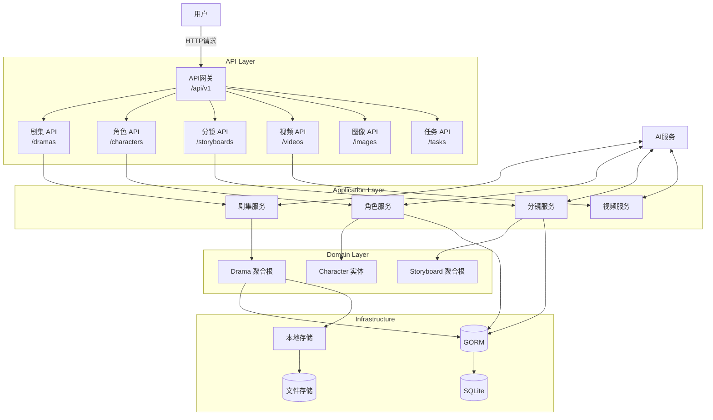
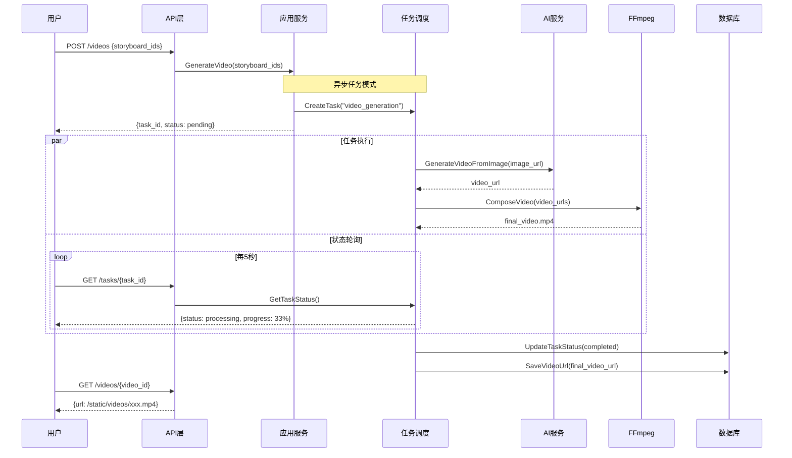

# 架构深度解析

> **学习目标**：深入理解火宝短剧系统采用的领域驱动设计（DDD）架构，掌握核心设计模式和架构决策背后的原理。
> 
> **前置知识**：建议先完成《基础知识回顾》的学习，具备软件开发基础。
> 
> **难度等级**：⭐⭐（核心概念）
> 
> **预计学习时间**：2-4小时

---

## 附录A：核心源文件索引

> 本节列出火宝短剧核心模块的实际文件路径，便于读者对照源码学习。

### A.1 目录结构概览

```
huobao-drama/
├── api/                    # API层（Gin HTTP处理器）
│   ├── handlers/           # HTTP请求处理器
│   │   ├── drama_handler.go      # 剧集处理器
│   │   ├── character_handler.go  # 角色处理器
│   │   ├── storyboard_handler.go # 分镜处理器
│   │   └── video_handler.go      # 视频处理器
│   ├── routes/             # 路由配置
│   │   └── routes.go       # 路由定义入口
│   └── middlewares/        # 中间件
│       ├── cors.go         # 跨域中间件
│       └── logger.go       # 日志中间件
│
├── application/            # 应用服务层
│   └── services/          # 业务服务编排
│       ├── drama_service.go
│       ├── character_service.go
│       └── ai_service.go   # AI服务封装
│
├── domain/                 # 领域层（核心业务逻辑）
│   ├── models/            # 领域实体
│   │   ├── drama.go
│   │   ├── character.go
│   │   └── storyboard.go
│   └── events/            # 领域事件
│       └── events.go
│
├── infrastructure/         # 基础设施层
│   ├── storage/           # 存储实现
│   │   └── local_storage.go
│   └── persistence/        # 数据持久化
│       └── gorm_repository.go
│
├── pkg/                    # 共享包
│   ├── config/            # 配置管理
│   ├── logger/            # 日志封装
│   └── ai/                # AI客户端
│       ├── openai_client.go
│       └── gemini_client.go
│
├── cmd/                    # 命令行入口
│   └── root.go
│
├── configs/                # 配置文件
│   └── config.yaml
│
└── main.go               # 程序入口
```

### A.2 关键文件速查

| 功能模块 | 文件路径 | 说明 |
|----------|----------|------|
| 路由入口 | `api/routes/routes.go` | 定义所有API端点 |
| 剧集CRUD | `api/handlers/drama_handler.go` | 处理剧集HTTP请求 |
| 角色管理 | `api/handlers/character_handler.go` | 处理角色HTTP请求 |
| 分镜生成 | `api/handlers/storyboard_handler.go` | 处理分镜HTTP请求 |
| 视频生成 | `api/handlers/video_handler.go` | 处理视频HTTP请求 |
| 配置加载 | `pkg/config/config.go` | YAML配置解析 |
| AI客户端 | `pkg/ai/openai_client.go` | OpenAI API封装 |
| 图像生成 | `pkg/image/openai_image_client.go` | DALL-E图像生成 |
| 视频生成 | `pkg/video/video_client.go` | 视频生成客户端 |
| 存储服务 | `infrastructure/storage/local_storage.go` | 本地文件存储 |
| GORM模型 | `domain/models/` | 数据库实体定义 |

### A.3 代码阅读建议

**从API到领域的阅读路径**：

1. 从 `api/routes/routes.go` 了解整体API结构
2. 查看 `api/handlers/drama_handler.go` 理解请求处理流程
3. 阅读 `application/services/drama_service.go` 理解业务编排
4. 分析 `domain/models/drama.go` 理解领域模型
5. 对照 `infrastructure/persistence/` 理解数据持久化

**文件阅读优先级**（按重要性排序）：
1. `api/routes/routes.go` - 理解整体架构
2. `application/services/drama_service.go` - 理解业务流程
3. `domain/models/drama.go` - 理解领域模型
4. `pkg/config/config.go` - 理解配置体系

---

## 第一章：领域驱动设计概述

### 1.1 DDD核心概念

**领域驱动设计（Domain-Driven Design，DDD）**是一种以业务领域为核心的软件开发方法论。DDD的核心思想是将软件的复杂性映射到业务领域的复杂性上，通过建立通用语言来消除技术和业务之间的鸿沟。

**为什么选择DDD**：在火宝短剧这样的AI创作平台中，核心业务逻辑涉及剧本创作、角色设计、分镜制作、视频生成等多个领域，每个领域都有其独特的概念、规则和变化模式。传统的三层架构（表现层-业务逻辑层-数据访问层）往往难以清晰地表达这些领域概念，导致业务逻辑分散在各处，难以维护和演进。DDD通过将系统划分为有界上下文，每个上下文内部拥有自己的领域模型，使得复杂业务能够被清晰地组织和管理。

**DDD的关键术语**：

| 术语 | 定义 | 在火宝短剧中的体现 |
|------|------|-------------------|
| 领域（Domain） | 业务所在的现实世界问题空间 | AI短剧创作 |
| 模型（Model） | 对领域的抽象和简化 | 剧本、角色、分镜等实体 |
| 通用语言（Ubiquitous Language） | 团队共享的术语体系 | 术语表和代码命名规范 |
| 有界上下文（Bounded Context） | 明确的边界，内部有统一的模型 | 项目上下文、剧本上下文 |
| 聚合（Aggregate） | 数据变更的一致性边界 | Project聚合、Script聚合 |
| 领域事件（Domain Event） | 领域内发生的重要事件 | ProjectCreatedEvent |

### 1.2 核心域与支撑域

**核心域**是系统存在的根本原因，是业务的核心竞争力所在。在火宝短剧中，核心域包括：

- **剧本生成**：利用AI将创意转化为剧本
- **分镜制作**：将剧本转化为视觉画面
- **视频生成**：将静态图像转化为动态视频

**支撑域**是支撑核心域运转的必要功能，但并非核心竞争力所在：

- **用户管理**：认证、授权
- **资产管理**：文件存储、CDN
- **任务调度**：异步任务处理

**通用域**是可以直接复用的通用功能：

- **日志记录**
- **配置管理**
- **基础设施库**

### 1.3 限界上下文映射

限界上下文之间的映射关系定义了系统各部分的协作方式：

```
用户 ──[使用]──▶ 项目上下文
                         │
                         ├──[包含]──▶ 剧本上下文
                         │
                         ├──[包含]──▶ 角色上下文
                         │
                         └──[包含]──▶ 分镜上下文

任务上下文 ──[异步通信]──▶ 各生成上下文
```

---

### 1.3 限界上下文映射

限界上下文之间的映射关系定义了系统各部分的协作方式：



**上下文说明**：
- `dramas` → 剧集管理（顶层聚合）
- `characters` → 角色库管理
- `storyboards` → 分镜/场景管理
- `videos` → 视频生成
- `images` → 图像生成
- `tasks` → 异步任务状态查询

### 1.4 视频生成流程时序

以下时序图展示从用户请求到视频生成完成的完整流程：



**关键设计点**：
1. 视频生成是**异步操作**，立即返回任务ID
2. 使用**任务调度器**管理长时间运行的AI生成任务
3. FFmpeg负责最终的视频合成
4. 客户端通过轮询 `/tasks/{task_id}` 获取进度

---

## 第二章：聚合根设计

### 2.1 聚合的概念

**聚合**是领域驱动设计中的核心概念，是一组相关对象的集合，这些对象被视为一个数据变更的单元。聚合根是聚合的入口点，负责维护聚合内部的一致性。

**聚合的设计原则**：

| 原则 | 说明 | 示例 |
|------|------|------|
| 边界清晰 | 每个聚合有明确的边界 | Project聚合包含Scripts、Characters |
| 引用唯一 | 聚合间通过ID引用 | Storyboard引用CharacterID |
| 一致性边界 | 聚合内数据变更必须一致 | 添加剧本时检查名称唯一性 |

### 2.2 Project聚合根详解

**Project聚合**是火宝短剧中最顶层的聚合，所有其他聚合都归属于某个Project：

```go
// Project 聚合根
type Project struct {
    ID          string        `json:"id"`
    Name        string        `json:"name"`
    Description string        `json:"description"`
    OwnerID     string        `json:"owner_id"`
    Settings    Settings      `json:"settings"`
    Status      string        `json:"status"`
    
    // 聚合内部对象
    scripts     []*Script
    characters  []*Character
    storyboards []*Storyboard
    videos     []*Video
    
    // 元数据
    CreatedAt   time.Time
    UpdatedAt   time.Time
}
```

**聚合不变性规则**：

```go
// AddScript 添加剧本到项目
func (p *Project) AddScript(script *Script) error {
    // 不变性检查1：剧本名称在项目内唯一
    for _, s := range p.scripts {
        if s.Name == script.Name {
            return ErrScriptNameDuplicate
        }
    }
    
    // 不变性检查2：项目状态允许添加剧本
    if p.Status == ProjectStatusClosed {
        return ErrProjectClosed
    }
    
    // 执行操作
    script.ProjectID = p.ID
    p.scripts = append(p.scripts, script)
    
    // 发布领域事件
    p.RegisterEvent(ScriptAddedEvent{
        ProjectID: p.ID,
        ScriptID:  script.ID,
    })
    
    return nil
}
```

### 2.3 聚合间关系

**聚合间的引用应该使用ID而非对象引用**：

```go
// 错误示例：直接引用其他聚合
type Storyboard struct {
    Project   *Project  // ❌ 不推荐
    Character *Character  // ❌ 不推荐
}

// 正确示例：使用ID引用
type Storyboard struct {
    ProjectID   string  // ✅ 推荐
    CharacterID string  // ✅ 推荐
}
```

**为什么使用ID引用**：

1. **事务边界**：聚合是事务的最小单元，聚合间不应共享事务
2. **性能**：只加载需要的字段，避免加载整个对象图
3. **一致性**：避免多个聚合共享同一对象导致的数据不一致

---

## 第三章：领域服务与领域事件

### 3.1 领域服务

**领域服务**用于表达那些不属于任何实体或值对象的业务逻辑。当某个操作需要协调多个聚合根，或者需要与外部系统交互时，应该使用领域服务。

**领域服务的设计原则**：

1. **无状态**：领域服务应该是无状态的，不保存任何状态信息
2. **幂等性**：相同的输入应该产生相同的输出
3. **纯粹性**：只包含领域逻辑，不涉及技术细节

**示例：ScriptGenerationService**

```go
// IScriptGenerationService 剧本生成领域服务接口
type IScriptGenerationService interface {
    GenerateFromPrompt(ctx context.Context, prompt string, options GenerationOptions) (*Script, error)
    EnhanceScript(ctx context.Context, script *Script, feedback string) (*Script, error)
}

// GenerationOptions 生成选项
type GenerationOptions struct {
    Style       string
    Length      LengthOption
    Language    string
    IncludeStageDirections bool
}
```

### 3.2 领域事件

**领域事件**是领域中发生的重要事情的记录，用于解耦系统各部分之间的依赖。

**领域事件的设计要点**：

| 要点 | 说明 |
|------|------|
| 事件命名 | 使用过去式命名，如ScriptCreatedEvent |
| 事件数据 | 包含足够的信息供订阅者处理 |
| 事件顺序 | 确保同一聚合根的事件按时间顺序处理 |
| 幂等性 | 事件处理器应该能够处理重复事件 |

**领域事件示例**：

```go
// ScriptCreatedEvent 剧本创建事件
type ScriptCreatedEvent struct {
    EventID     string    `json:"event_id"`
    EventType   string    `json:"event_type"`
    ProjectID   string    `json:"project_id"`
    ScriptID    string    `json:"script_id"`
    ScriptTitle string    `json:"script_title"`
    GeneratedBy string    `json:"generated_by"`  // AI或用户
    Timestamp   time.Time `json:"timestamp"`
}

func (e *ScriptCreatedEvent) EventID() string      { return e.EventID }
func (e *ScriptCreatedEvent) EventType() string    { return "script.created" }
func (e *ScriptCreatedEvent) AggregateID() string   { return e.ScriptID }
func (e *ScriptCreatedEvent) Timestamp() time.Time { return e.Timestamp }
```

**事件的发布与处理**：

```go
// 发布领域事件
func (p *Project) PublishEvents(ctx context.Context, eventBus IEventBus) error {
    for _, event := range p.events {
        if err := eventBus.Publish(ctx, event); err != nil {
            return err
        }
    }
    p.events = nil  // 清空已发布的事件
    return nil
}

// 事件处理器示例
type ScriptEventHandler struct {
    logger *zap.Logger
}

func (h *ScriptEventHandler) Handle(ctx context.Context, event domain.Event) error {
    switch e := event.(type) {
    case *ScriptCreatedEvent:
        h.logger.Info("剧本已创建",
            zap.String("script_id", e.ScriptID),
            zap.String("project_id", e.ProjectID),
        )
        // 执行后续操作，如发送通知、更新统计等
    }
    return nil
}
```

---

## 第四章：仓储模式

### 4.1 仓储接口

**仓储（Repository）**是DDD中用于访问聚合根的抽象接口。仓储隐藏了数据访问的细节，领域层只需要调用仓储的方法，而不需要知道数据是如何存储的。

**仓储接口定义（在领域层）**：

```go
// IProjectRepository 项目仓储接口
type IProjectRepository interface {
    // 查询操作
    FindByID(ctx context.Context, id string) (*Project, error)
    FindByOwner(ctx context.Context, ownerID string, pagination Pagination) ([]*Project, error)
    FindByName(ctx context.Context, name string) ([]*Project, error)
    
    // 持久化操作
    Save(ctx context.Context, project *Project) error
    Update(ctx context.Context, project *Project) error
    Delete(ctx context.Context, id string) error
    
    // 聚合查询
    FindWithScripts(ctx context.Context, projectID string) (*Project, error)
    FindWithCharacters(ctx context.Context, projectID string) (*Project, error)
}
```

**仓储接口设计原则**：

| 原则 | 说明 | 示例 |
|------|------|------|
| 接口在领域层 | 仓储接口定义在领域层 | domain/repositories/ |
| 方法命名清晰 | 使用领域术语命名 | FindByName而非FindByProjectName |
| 返回聚合根 | 方法返回聚合根或聚合根列表 | 返回*Project而非*ProjectEntity |
| 支持查询 | 提供必要的查询方法 | FindByOwner、FindByStatus |

### 4.2 仓储实现

**仓储实现（在基础设施层）**：

```go
// GormProjectRepository 基于GORM的项目仓储实现
type GormProjectRepository struct {
    db *gorm.DB
}

// FindByID 根据ID查询项目
func (r *GormProjectRepository) FindByID(ctx context.Context, id string) (*Project, error) {
    var projectEntity ProjectEntity
    
    err := r.db.WithContext(ctx).First(&projectEntity, "id = ?", id).Error
    if err != nil {
        if errors.Is(err, gorm.ErrRecordNotFound) {
            return nil, domain.ErrProjectNotFound
        }
        return nil, err
    }
    
    return r.toDomain(&projectEntity), nil
}

// Save 保存项目
func (r *GormProjectRepository) Save(ctx context.Context, project *Project) error {
    entity := r.toEntity(project)
    
    // 判断是新增还是更新
    exists, err := r.exists(ctx, project.ID)
    if err != nil {
        return err
    }
    
    if exists {
        return r.db.WithContext(ctx).Save(entity).Error
    }
    return r.db.WithContext(ctx).Create(entity).Error
}
```

### 4.3 数据模型映射

**实体与领域对象映射**：

```go
// ProjectEntity 数据库实体
type ProjectEntity struct {
    ID          string    `gorm:"primaryKey;type:varchar(36)"`
    Name        string    `gorm:"type:varchar(100);not null"`
    Description string    `gorm:"type:text"`
    OwnerID     string    `gorm:"type:varchar(36);not null;index"`
    Settings    string    `gorm:"type:text"`  // JSON存储
    Status      string    `gorm:"type:varchar(20);not null;default:active"`
    CreatedAt   time.Time `gorm:"autoCreateTime"`
    UpdatedAt   time.Time `gorm:"autoUpdateTime"`
}

// toDomain 转换为领域对象
func (r *GormProjectRepository) toDomain(entity *ProjectEntity) *domain.Project {
    var settings domain.Settings
    if entity.Settings != "" {
        json.Unmarshal([]byte(entity.Settings), &settings)
    }
    
    return &domain.Project{
        ID:          entity.ID,
        Name:        entity.Name,
        Description: entity.Description,
        OwnerID:     entity.OwnerID,
        Settings:    settings,
        Status:      entity.Status,
        CreatedAt:   entity.CreatedAt,
        UpdatedAt:   entity.UpdatedAt,
    }
}

// toEntity 转换为数据库实体
func (r *GormProjectRepository) toEntity(project *domain.Project) *ProjectEntity {
    settings, _ := json.Marshal(project.Settings)
    
    return &ProjectEntity{
        ID:          project.ID,
        Name:        project.Name,
        Description: project.Description,
        OwnerID:     project.OwnerID,
        Settings:    string(settings),
        Status:      project.Status,
        CreatedAt:   project.CreatedAt,
        UpdatedAt:   project.UpdatedAt,
    }
}
```

---

## 第五章：应用服务层

### 5.1 应用服务职责

**应用服务**是系统的「编排层」，负责协调领域对象完成业务用例。应用服务不包含业务规则，它只知道「做什么」，不知道「怎么做」。

**应用服务与领域服务的区别**：

| 对比维度 | 应用服务 | 领域服务 |
|----------|----------|----------|
| 职责 | 编排业务流程 | 执行业务规则 |
| 所在层 | 应用服务层 | 领域层 |
| 依赖 | 依赖领域对象和领域服务 | 只依赖领域概念 |
| 事务 | 管理事务边界 | 不涉及事务 |
| 返回值 | DTO或领域对象 | 领域对象或值对象 |

### 5.2 应用服务示例

```go
// ProjectAppService 项目应用服务
type ProjectAppService struct {
    projectRepo   domain.IProjectRepository
    scriptService domain.IScriptGenerationService
    eventBus      domain.IEventBus
    logger        *zap.Logger
}

// GenerateScript 生成剧本
func (s *ProjectAppService) GenerateScript(ctx context.Context, req *GenerateScriptRequest) (*TaskResponse, error) {
    // 1. 获取项目
    project, err := s.projectRepo.FindByID(ctx, req.ProjectID)
    if err != nil {
        return nil, err
    }
    
    // 2. 调用领域服务生成剧本
    script, err := s.scriptService.GenerateFromPrompt(
        ctx,
        req.Prompt,
        domain.GenerationOptions{
            Style:  domain.LengthOption(req.Length),
            Style:  req.Style,
            Length: req.Length,
        },
    )
    if err != nil {
        return nil, err
    }
    
    // 3. 将剧本添加到项目
    if err := project.AddScript(script); err != nil {
        return nil, err
    }
    
    // 4. 持久化
    if err := s.projectRepo.Save(ctx, project); err != nil {
        return nil, err
    }
    
    // 5. 发布事件
    if err := project.PublishEvents(ctx, s.eventBus); err != nil {
        s.logger.Error("failed to publish events", zap.Error(err))
    }
    
    return ToTaskResponse(script.GetGenerationTask()), nil
}
```

### 5.3 事务管理

**应用服务层负责管理事务边界**：

```go
func (s *ProjectAppService) CreateProject(ctx context.Context, req *CreateRequest) (*ProjectResponse, error) {
    // 开启事务
    tx := s.db.Begin()
    ctx = context.WithValue(ctx, "tx", tx)
    
    defer func() {
        if r := recover(); r != nil {
            tx.Rollback()
        }
    }()
    
    // 创建项目
    project, err := s.createProjectInTx(ctx, req)
    if err != nil {
        tx.Rollback()
        return nil, err
    }
    
    // 创建默认剧本
    _, err = s.createScriptInTx(ctx, project.ID, req.Script)
    if err != nil {
        tx.Rollback()
        return nil, err
    }
    
    // 提交事务
    tx.Commit()
    
    return ToProjectResponse(project), nil
}
```

---

## 练习任务

### 练习1：聚合设计练习（⭐⭐）

**任务目标**：设计一个新的聚合根

**任务要求**：设计一个「素材库（AssetLibrary）」聚合，包含素材库聚合根、素材项实体、素材标签值对象，实现基本的CRUD操作。

**验收标准**：

| 检查项 | 完成情况 |
|--------|----------|
| 聚合边界清晰 | ☐ |
| 不变性约束正确 | ☐ |
| 仓储接口定义合理 | ☐ |
| 代码符合DDD规范 | ☐ |

---

## 相关文档链接

| 文档名称 | 说明 | 难度 |
|----------|------|------|
| [基础知识回顾](fundamentals.md) | 核心技术概念回顾 | ⭐ |
| [性能优化](performance.md) | 性能分析和优化方法 | ⭐⭐⭐ |
| [设计模式](design_patterns.md) | 架构模式和最佳实践 | ⭐⭐⭐⭐ |

---

## 版本信息

| 版本 | 日期 | 变更说明 |
|------|------|----------|
| v1.0.0 | 2026-02-06 | 初始版本，包含架构深度解析 |
